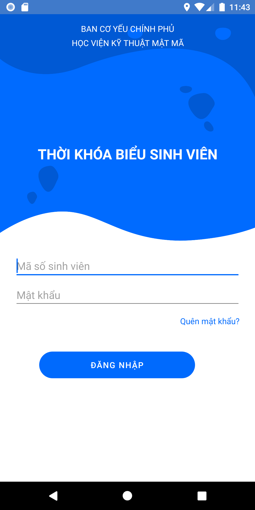
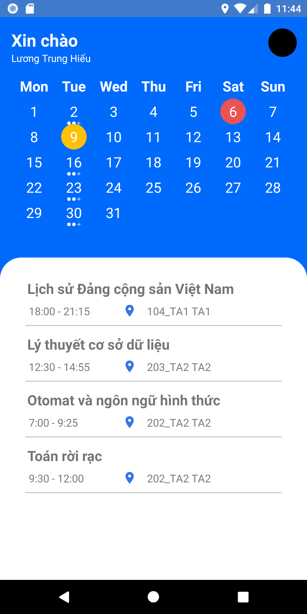

# KMA-Schedule
* This is a native app based on Java
This an schedule app for supporting a amazing schedule to student KMA.  
Currently, it has 2 main functions namely: Login by StudentID and Passowrd, watching calendar.

<h3> How to use it: </h3>
- Open the app  
- Fill out studentID field, password field 
- Click any date and look at below layout, schedule will be shown. 

<h3> Notice: this app uses student account was provided by Vietnam Academy of Cryptography Techniques </h3>

<h3> Screenshot </h3>

## Author
Facebook: [HiuTrun](https://www.facebook.com/hiutrun0x0/)  
Instagram: [HiuTrun](https://www.instagram.com/hiutrun0x0/)  
